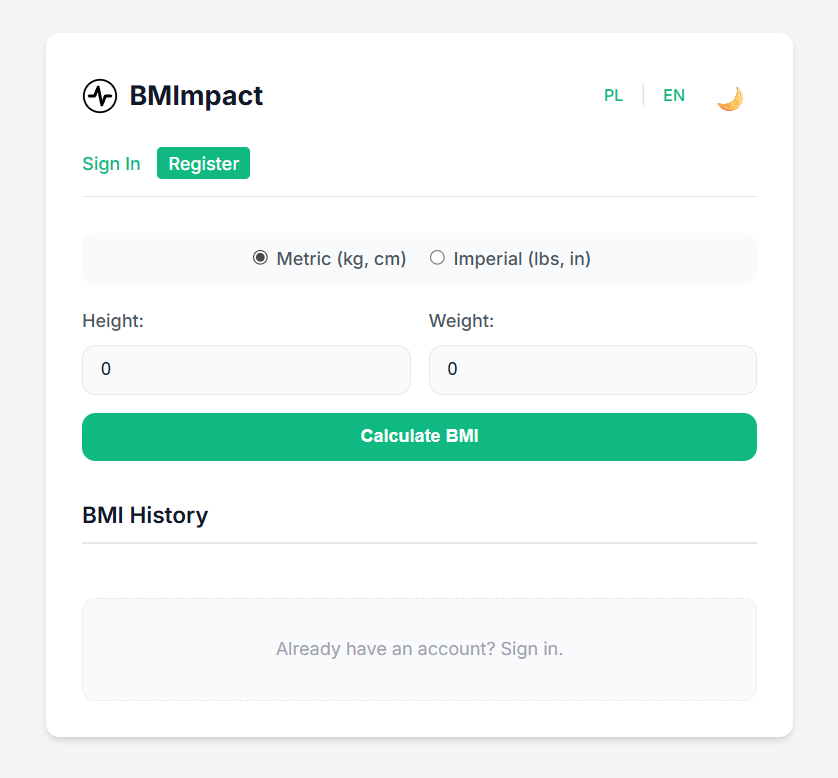
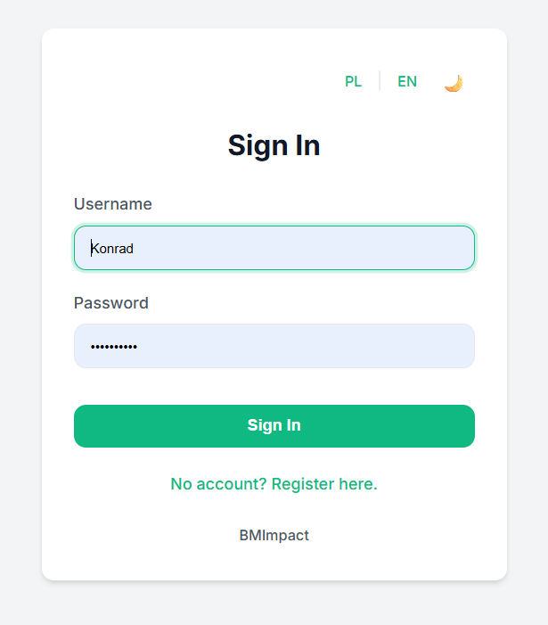
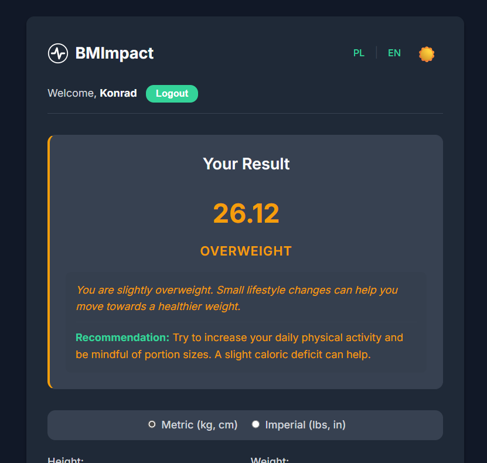
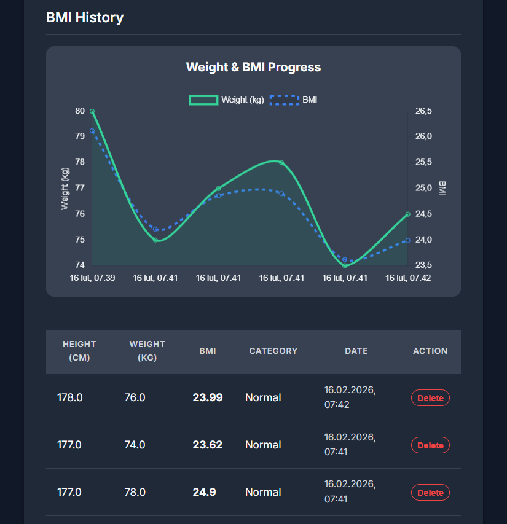
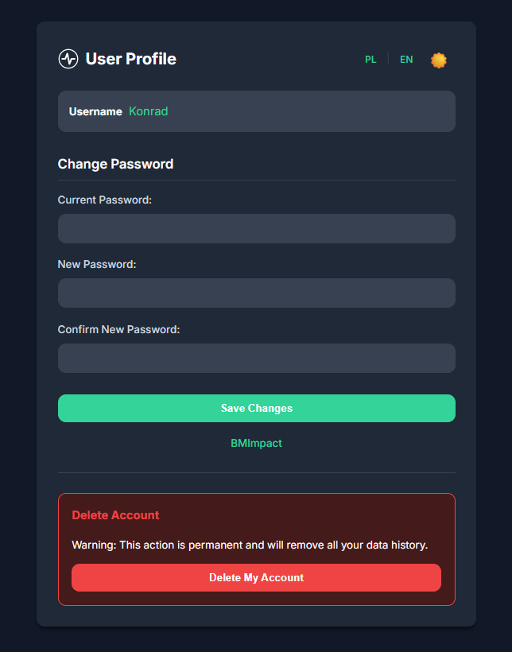

# 🚀 BMImpact - Advanced BMI Calculator

BMImpact is a modern, Spring Boot-based application for calculating Body Mass Index (BMI). It offers user authentication, history tracking, data visualization, and internationalization support.

## ✨ Features
* ⚖️ **BMI Calculation**: Supports both Metric (kg/cm) and Imperial (lbs/in) systems.
* 🔐 **User Accounts**: Secure registration and login system.
* 📅 **History Tracking**: Save your results and view them later (Registered users only).
* 📊 **Data Visualization**: Interactive charts showing weight and BMI progress over time.
* 🌍 **Internationalization**: Fully localized in English and Polish.
* 🌗 **Dark Mode**: Toggle between light and dark themes.
* 📱 **Responsive Design**: Mobile-friendly interface.

## 📸 Screenshots

<details>
  <summary>See Home Page</summary>
  <br>
  
  <br>
</details>
<details>
  <summary>See Login Page</summary>
  <br>
  
  <br>
</details>
<details>
  <summary>See BMI Information</summary>
  <br>
  
  <br>
</details>
<details>
  <summary>See BMI Chart And History</summary>
  <br>
  
  <br>
</details>
<details>
  <summary>See Profile Page</summary>
  <br>
  
  <br>
</details>

## 🛠️ Tech Stack
* ☕ **Java 21**
* 🍃 **Spring Boot 4** (Web, Security, Data MongoDB, Validation, Test)
* 🍃 **Thymeleaf** (with Spring Security extras)
* 💾 **MongoDB**
* 📉 **Chart.js**
* 🎨 **HTML5 / CSS3 / JavaScript**

## 📋 Prerequisites
* ☕ Java Development Kit (JDK) 21 or higher.
* 💾 MongoDB installed and running.

## 🚀 Getting Started

1.  **Clone the repository**
    ```bash
    git clone https://github.com/konradcz2001/bmimpact.git
    cd bmimpact
    ```

2.  **Configure Database**
    The application prioritizes the `MONGO_URI` environment variable.
    * **Production/Docker**: Set `MONGO_URI` to your database connection string.
    * **Local Development**: If `MONGO_URI` is not set, the app defaults to `mongodb://localhost:27017/bmimpact`.

3.  **Run the Application**
    ```bash
    ./mvnw spring-boot:run
    ```

4.  **Access the App**
    Open your browser and navigate to: `http://localhost:8080`

## 📖 Usage
* **Guest**: Calculate BMI instantly without saving data.
* **User**: Register to save history, view charts, and manage your profile.
* **Profile**: Change password or delete account (with data wipe).

## 📄 License
Distributed under the MIT License. See [LICENSE](LICENSE) for more information.
